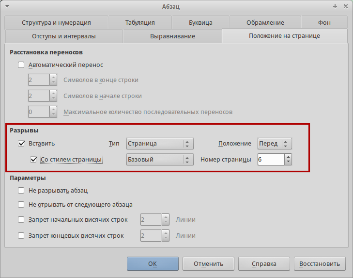
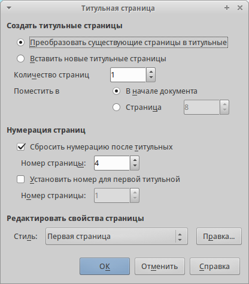
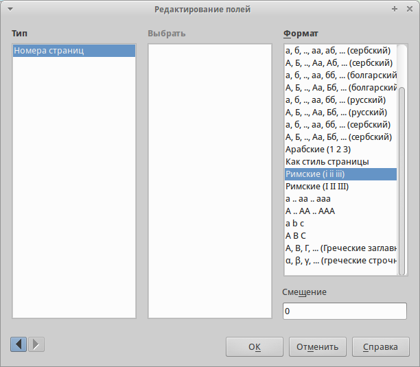

:title: LibreOffice: Все о нумерации страниц (Часть II)
:date: 2015-01-30
:category: LibreOffice
:tags: Руководства, LibreOffice, Writer, Impress, Calc, Base, Draw

.. contents:: Оглавление
   :depth: 3

Статья является продолжением статьи `LibreOffice: Все о нумерации
страниц (Часть
I) <http://librerussia.blogspot.ru/2015/01/libreoffice-page-numbers.html>`__.
В ней идет речь о сложной нумерации страниц в Writer. Простые способы
нумерации, в том числе с использованием расширения, описаны в первой
части.

Вставка страниц в Writer на первый взгляд кажется чем-то непонятным и
весьма странным. Признаюсь, сам не сразу оценил её когда только начинал
пользоваться LibreOffice. Но когда уделил этому вопросу немного времени,
понял насколько это мощная функция и почему она реализована именно так.

В данной статье собрана исчерпывающая информация по этому вопросу.
Некоторые вещи освещены впервые.

В последнее время я совсем не лаконичен и мои статьи содержат много
рассуждений (степень Магистра дает о себе знать). Наберитесь терпения и
вы будете вознаграждены.

Дурные привычки
---------------

Самый главный враг пользователя - это его дурные привычки, доставшиеся
ему от Майкрософт Оффис (МСО). Поразительно, что МСО поддерживает
грамотную работу с документами, которая мало чем отличается от работы с
документами в LibreOffice. Вот только всевозможные руководства (и
официальные тоже) умалчивают об этом и прививают пользователям МСО
совершенно неправильный подход к созданию документов.

Вернемся к нумерации. В МСО есть специальный диалог для быстрой
нумерации страниц. В LibreOffice по умолчанию такого диалога нет, но с
помощью плагина `Pager <http://myooo.ru/content/view/106/99/>`__ вы
получите более простой и более мощный инструмент нумерации страниц.

Как ни странно, простая нумерация страниц в МСО и LibreOffice делается
одинаково (чего не скажешь о сложной). Я имею ввиду не столько процесс,
сколько его реализацию. Диалог нумерации страниц в МСО всего навсего
автоматизирует то, что в стандартном LibreOffice делается вручную.

Давайте посмотрим что происходит в МСО под капотом функции нумерации,
когда мы вставляем номер страницы:

#. К странице добавляется колонтитул.
#. В колонтитул вставляется поле (счётчик) с номером страницы.
#. Поле с номером выравнивается по нужной стороне.

А теперь сравним это с процессом нумерации в LibreOffice:

#. Добавьте верхний или нижний колонтитул (*Вставка → Верхний/Нижний
   Колонтитул*).
#. Установите курсор в колонтитул и вставьте поле с номером страницы
   используя *Вставка → Поля → Номер страницы*.
#. С помощью кнопок выравнивания текста расположите номер
   слева/справа/по центру.

Кстати, если вы проделаете те же действия в МСО (в 03 версии даже пункты
меню совпадают), то вы получите совершенно такой же эффект, как и при
использовании диалога нумерации страниц.

Больше того, можно воспользоваться функцией Записи макроса
[1]_ и сделать кнопку на панели [2]_ ,
которая будет автоматически вставлять нумерацию страниц в соответствии с
вашими требованиями.

Казалось бы, раз все сделано одинаково, почему бы не встроить в
LibreOffice диалог для быстрой нумерации. И тут ответ прост, читайте
следующий раздел.

Шаблоны
-------

Пользователей удивляет, почему в LibreOffice нужно делать на один клик
больше. Ведь это так тяжело. Конечно, их главный аргумент в том, что
каждый раз вставлять нумерацию таким образом очень утомительно.

И у меня возникает встречный вопрос. А зачем делать это каждый раз?
Зачем каждый раз начинать создание документа с чистого листа?

Ленивые пользователи просто создают шаблон документа, в котором один раз
задают колонтитулы и нумерацию. Остальные документы просто создаются на
основе этого шаблона. Таким образом, используя шаблоны вообще не нужно
вставлять нумерацию, так как она там уже есть.

При желании можно изменить стандартный шаблон документа и у вас всегда
будет открываться документ с уже проставленной нумерацией. Экономия
кликов на лицо.

Справедливости ради, в МСО также можно сделать или изменить стандартный
шаблон и тоже экономить клики. Но вместо этого бывшие МСО-пользователи
предпочитают писать `грязные
пасквили <http://forum.ubuntu.ru/index.php?topic=203117.msg2029439#msg2029439>`__
в адрес LibreOffice и его разработчиков.

Подобные комментарии лишний раз подтверждают вредность привычек,
привитых использованием МСО. Если бы люди правильно использовали весь
функционал того же МСО, им бы было гораздо проще привыкнуть к
LibreOffice.

Про шаблоны можно дополнительно почитать:

-  `Использование шаблона для создания
   документа <http://libreoffice.readthedocs.org/ru/latest/Using-Styles-and-Templates.html#id20>`__
-  `LibreOffice: Изменение стандартного
   шаблона <http://librerussia.blogspot.ru/2014/11/libreoffice_8.html>`__

Стили страниц
-------------

Ещё одна причина недовольства нумерацией страниц в LibreOffice
заключается в странном, по версии пользователей, поведении нумерации. То
они жалуются, что нумерация сбилась, то нумерация у них пошла заново.

Все это говорит о полном непонимании пользователями основных принципов
работы с документами. Ниже пойдет речь о всевозможных трюках с
нумерацией и у меня ни разу не возникало никаких проблем.

Вернемся к стилям страниц. Стили страниц вкупе с разрывами позволяют
задать отдельные формат нумерации для каждого стиля. Простым примером
может служить ситуация, когда имеются правые и левые страницы с
выровненными номерами страниц (по правой и левой стороне
соответственно).

Стили страниц не хранят информацию непосредственно о самой нумерации, но
сохраняют настройки колонтитулов (размер колонтитула, выравнивание).

Также с помощью стиля страницы и разрыва страницы можно сделать
нумерацию не по порядку, т.е. за страницей с номером 3 может следовать
страница с номером 9.

Кстати, при использовании стиля страницы, которая уже содержит
колонтитул, тоже происходит экономия кликов, достаточно только вставить
поле с номером.

Один из трюков со стилями и разрывами страницы приведен в статье
`Изменение ориентации отдельных
страниц <http://librerussia.blogspot.ru/2015/01/libreoffice-writer-break.html>`__.

Далее я опишу некоторые приемы работы с нумерацией. Некоторые приемы
просто невозможно повторить используя диалог нумерации страниц.

Нумерация не с первой страницы
------------------------------

Допустим, что документ должен начинаться не с 1-й страницы, а с 6-й. Тут
есть одна тонкость: *Новый номер страницы является атрибутом первого абзаца страницы.* [3]_.

Помните, что я писал в статье `Изменение ориентации отдельных
страниц <http://librerussia.blogspot.ru/2015/01/libreoffice-writer-break.html>`__ в разделе *И снова о логике*:

*Дело в том, что такие программы, как LibreOffice, оперирую абзацами.
Абзац первичен, без абзаца нет страницы. Ни в LibreOffice, ни в МС Офис
невозможно создать абсолютно пустую страницу. Всегда на новой странице
будет находиться мигающий курсор и будет автоматически сделана пустая
строка. Да, пустая строка это тоже абзац.*

Итак. Чтобы изменить номер первой страницы, необходимо:

#. Установить курсор в первом абзаце страницы и открыть диалог настройки
   *Абзаца* (*Формат → Абзац*). Или свойства стиля первого абзаца, если
   вы пользуетесь стилями абзацев (А я надеюсь, что вы ими пользуетесь).
   Диалоги *Абзац* и *Свойства стиля Абзаца* аналогичны.
#. Перейти в диалоге на вкладку *Положение на странице*.
#. Включить в разделе *Разрывы* маркер *Вставить* и *Со стилем
   страницы*.
#. В списке *Положение* выбрать *Перед*
#. В списке *Номер страницы* указать желаемый номер.

Внимание! Не используйте *смещение* для задания нумерации страниц.

Произвольная нумерация
----------------------

Может понадобится сделать произвольную нумерацию, т.е. сначала будет
идти страница с номером 4, потом с номером 11, потом 25. Тут имеется
ввиду именно создание произвольной нумерации, а не физическая
перестановка страниц.

Это также достигается за счет того, что описано в предыдущем пункте -
стили и разрывы.

Не нумеровать первую страницу
-----------------------------

Чтобы не нумеровать первую страницу, ей нужно присвоить соответствующий
стиль. По умолчанию в LibreOffice есть стиль *Первая страница*. Но можно
сделать свой отдельный стиль страницы.

Далее просто присваиваете первой странице нужный стиль, например,
*Первая страница*. Затем добавляете после неё разрыв страницы с другим
стилем, который уже будет содержать колонтитулы.

Чтобы лучше понимать этот процесс, прочитайте статьи `Руководство по
стилям
LibreOffice <http://librerussia.blogspot.ru/2014/11/LibreOffice-Styles-000.html>`__
и `Изменение ориентации отдельных
страниц <http://librerussia.blogspot.ru/2015/01/libreoffice-writer-break.html>`__.
В руководстве по стилям описаны основы работы со стилями, как создавать
их и использовать.

Но есть и более простой способ убрать номер с первой страницы. В
LibreOffice есть специальный диалог *Титульная страница*\ (*Формат →
Титульная страница*).

Он вполне понятен и не требует дополнительных разъяснений. Но я лично
его не использую, так как делаю всё с помощью стилей. По сути, данный
диалог просто автоматизирует процесс.

Смешанный тип нумерации
-----------------------

Во многих иностранных учебниках, а иногда и в русскоязычных, встречается
смешанная нумерация. Например, страницы с оглавлением нумеруются в стиле
i, ii, iii и т.д., а страницы с основным текстом уже идут с арабской
нумерацией. Это только малая часть возможных форматов нумерации.

Опять же, достигается это за счёт использования стилей страницы и
разрывов.

Поясню на примере. Для руководств я обычно создаю следующие стили
страниц:

-  Титульная (без колонтитулов и нумерации)
-  Импрессум (без колонтитулов и нумерации)
-  Оглавление (с колонтитулом и нумерацией)
-  Правая (с колонтитулом и нумерацией)
-  Левая (с колонтитулом и нумерацией)

*Титульная* страница идет первой, за ней через разрыв идет страница со
стилем *Импрессум* (страница с выходными сведениями). Потом через разрыв
добавляю страницы со стилем *Оглавление*.

Стиль *Оглавление* содержит колонтитулы в которых добавляю номер
страницы. Теперь, чтобы изменить стиль нумерации нужно дважды нажать на
номер страницы. Откроется диалог *Редактирование полей*. В поле *Формат*
выберите нужный формат нумерации (в нашем случае римские).

Теперь главный нюанс. Все последующие страницы со стилем *Оглавление*
будут иметь именно такой тип нумерации.

После оглавления через разрыв вставляется стиль страницы *Левая*. В
колонтитул страницы вставляется поле с номером страницы в арабском
формате. Номер выравнивается по левому краю.

И тут другой нюанс. В свойствах стилей можно указать параметр *Следующий
стиль*. Т.е., например, следующий стиль у стиля *Импрессум* стоит также
*Импрессум*, так как оглавление генерируется автоматически и может
занимать несколько страниц.

У стиля *Левая* следом автоматически идет страница со стилем *Правая*, а
у правой следом идет страница со стилем *Левая*. В данном случае разрывы
не нужны, так как стиль меняется автоматически. Подробнее о свойстве
*Следования* (не путать с *Наследованием*) читайте в `Руководстве по
стилям
LibreOffice <http://librerussia.blogspot.ru/2014/11/LibreOffice-Styles-000.html>`__.

У страницы со стилем *Правая* номер выравнивается по правой стороне и
может быть в другом формате (но в нашем случае формат совпадает с
*Левой* страницей).

Таким образом, мы имеем следующее положение дел. У всех страниц со
стилем страниц *Импрессум* нумерация страниц идет в римском формате. У
всех страниц со стилем *Левый* страницы нумеруются в арабском формате. У
всех страниц со стилем *Правый* могут идти в другом формате.

Абсолютное незнание свойств стилей страниц большинством пользователей
приводит к разного рода проблемам. Им кажется, что LibreOffice сошел с
ума и творит всякий бред. На деле же проблема, как обычно, в самих
пользователях.

Чтобы ознакомиться на примере, изучите мой шаблон для технической
документации. Скачать его можно
`здесь <https://github.com/LibreRussia/libreoffice-templates>`__.

Смещение
--------

В диалоге *Редактирование полей*, о котором сказано в предыдущем пункте,
есть параметр смещение. Он может влиять на нумерацию страниц, но не
стоит использовать его в этих целях.

Это очень редко-используемая функция. Обычно применяется в случае, когда
нужно в тексте документа сослаться на номер страницы, отстоящей от
текущей на n вперёд или назад.

Я никогда не использую эту функцию. И к тому же смещение, не сохраняется
в doc-формате.

Решение проблем
---------------

Еще раз повторюсь, несмотря на все выкрутасы с нумерацией, у меня не
возникало никаких проблем. Правда, я не пользуюсь форматами отличными от
ODF.

Не исключаю, что криво сделанные и сохраненные в убогие форматы (docx,
doc и т.д.) документы могут таить в себе сюрпризы. Но, думаю, знание
основ нумерации страниц в LibreOffice поможет преодолеть все
неприятности.

#. Если нумерация начинается с определенного номера (который вас не
   устраивает), проверьте свойства первого абзаца, расположенного на
   первой странице.
#. Нумерация внезапно началась сначала. Проверьте свойства первого
   абзаца на странице. Также проверьте используемый стиль страницы.

Нумерация с заголовком документа
--------------------------------

Данная статья получилась слишком большой, поэтому пример создания
красивых колонтитулов, содержащих помимо номера страницы и название
текущей главы я опишу в другой статье. Тем более это касается
колонтитулов, а не самой нумерации.

Заключение
----------

МСО и LibreOffice использует один и тот же подход в работе с
документами. Его же придерживается и Google Docs, AbiWord, CorelOffice,
Kingsoft Office и многие другие программы, связанные с текстом.

По большому счету, интерфейс и расположение кнопок и меню не играют
никакой роли. Если пользователь хорошо владеет функционалом какой-то из
программ, то привыкнуть к остальным аналогам проблемы не составит.

Вместо этого, к сожалению, пользователей приучают жать на определенные
кнопки в определенном месте экрана. Чуть сдвинь кнопку в сторону, и
пользователь в растерянности.

Думаю, я наглядно показал никчемность и бессмысленность большинства
нападок в адрес LibreOffice. Прежде чем возмущаться, и уж тем более
изливать свое возмущение, попробуйте сначала разобраться в сути вопроса.

И что самое смешное, все вышеописанное можно сделать и в Word. Но мало
кто из пользователей знает о таких возможностях программы. К тому же,
делается это все гораздо сложнее и непонятнее, чем в LibreOffice.

Дополнительная информация
-------------------------

-  `LibreOffice: Все о нумерации страниц (Часть
   I) <http://librerussia.blogspot.ru/2015/01/libreoffice-page-numbers.html>`__
-  `Изменение ориентации отдельных
   страниц <http://librerussia.blogspot.ru/2015/01/libreoffice-writer-break.html>`__
-  `Руководство по стилям
   LibreOffice <http://librerussia.blogspot.ru/2014/11/LibreOffice-Styles-000.html>`__
-  `Справка: Номера
   страниц <https://help.libreoffice.org/Writer/Page_Numbers/ru>`__
-  `Writer.Страницы, оглавление и сноски: Часто задаваемые
   вопросы <https://wiki.openoffice.org/wiki/Writer.Страницы,_оглавление_и_сноски:_Часто_задаваемые_вопросы>`__
-  `Использование шаблона для создания
   документа <http://libreoffice.readthedocs.org/ru/latest/Using-Styles-and-Templates.html#id20>`__
-  `LibreOffice: Изменение стандартного
   шаблона <http://librerussia.blogspot.ru/2014/11/libreoffice_8.html>`__
-  `Поля с
   данными <http://librerussia.blogspot.ru/2014/10/libreoffice_2.html>`__
-  `Связанные
   поля <http://librerussia.blogspot.ru/2014/12/libreoffice-writer-base.html>`__

--------------

.. [1] `Использование инструмента «Запись макроса» в
   LibreOffice <http://infineconomics.blogspot.ru/2013/10/libreoffice.html>`__ 

.. [2] Примеры добавления меню и кнопок на панели описаны в статьях
   `Включение/Выключение отображения изображений в
   документе <http://librerussia.blogspot.ru/2015/01/libreoffice-images.html>`__    и `Параметры страницы в меню    Файл <http://librerussia.blogspot.ru/2015/01/libreoffice.html>`

.. [3] `Справка LibreOffice: Начало с определенного номера
   страницы <https://help.libreoffice.org/Writer/Page_Numbers/ru#.D0.9D.D0.B0.D1.87.D0.B0.D0.BB.D0.BE_.D1.81_.D0.BE.D0.BF.D1.80.D0.B5.D0.B4.D0.B5.D0.BB.D0.B5.D0.BD.D0.BD.D0.BE.D0.B3.D0.BE_.D0.BD.D0.BE.D0.BC.D0.B5.D1.80.D0.B0_.D1.81.D1.82.D1.80.D0.B0.D0.BD.D0.B8.D1.86.D1.8B>`__
